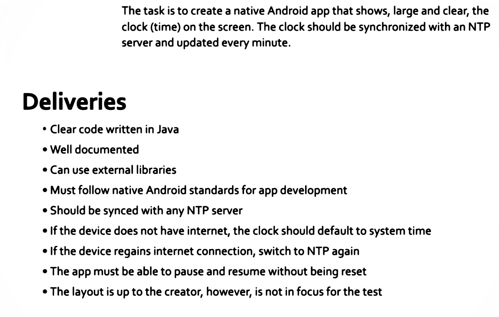
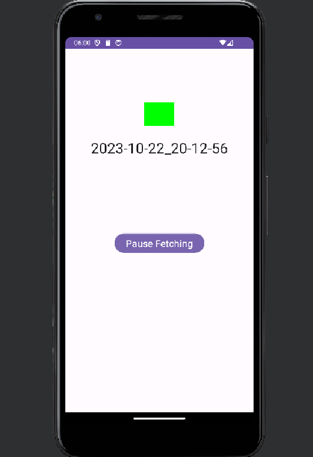
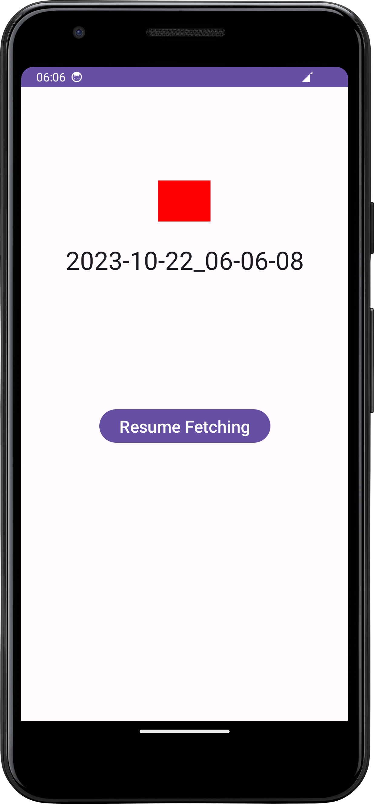

# SynchronizedClock Project

The SynchronizedClock project is a native Android application designed to accurately display the current time. The unique feature of this app is its ability to synchronize with an NTP (Network Time Protocol) server, ensuring that the displayed time is precise and consistent with the standard time.

## Project Instructions(Assignment Requirements and Objectives)

The app's design and flow are illustrated in the following image:

## Application Screenshots

The app has two primary visual states:

### Fetching State
In this state, the app is actively communicating with the NTP server to retrieve the current time. This ensures that the time displayed is accurate and up-to-date.

### Not-Fetching State
In this state, the app is not communicating with the NTP server. This might be due to a variety of reasons, such as lack of internet connectivity or the app being in a dormant state.

## Code Overview

The core functionality of the app is split into two primary files:

- [MainActivity.java](MainActivity.java): This is the entry point of the app. It sets up the user interface and handles user interactions.
  
- [UdpSntpService.java](UdpSntpService.java): This service is responsible for communicating with the NTP server. It uses the UDP protocol to send and receive time synchronization packets.
