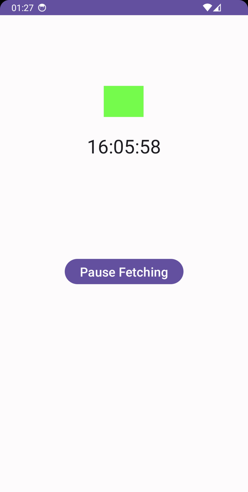

# SynchronizedClock Project

The SynchronizedClock project is a native Android application designed to accurately display the current time. The unique feature of this app is its ability to synchronize with an NTP (Network Time Protocol) server, ensuring that the displayed time is precise and consistent with the standard time.

## Application Features

- **NTP Synchronization**: The application retrieves the current time from an NTP server, ensuring precision and accuracy.
- **Network State Awareness**: The app has built-in capabilities to check for network connectivity, ensuring seamless synchronization when connected to the internet.
- **Visual Indicators**: The application provides visual indicators to inform users of its current state, whether it's fetching time from the NTP server or operating offline.

## Application Screenshots

The app has two primary visual states:

### Fetching State

    
In this state, the app is actively communicating with the NTP server to retrieve the current time. This ensures that the time displayed is accurate and up-to-date.

    
     

### Not-Fetching State

    
In this state, the app is not communicating with the NTP server. This might be due to a variety of reasons, such as lack of internet connectivity or the app being in a dormant state.

    
     

## Code Overview

The core functionality of the app is split into two primary files:

- [MainActivity.java](app/src/main/java/com/clockwise/synchronizedclock/MainActivity.java): This is the main activity and entry point of the app. It sets up the user interface, handles user interactions, and checks for network connectivity.

- [UdpSntpService.java](app/src/main/java/com/clockwise/synchronizedclock/UdpSntpService.java): This service is responsible for communicating with the NTP server. It uses the UDP protocol to send and receive time synchronization packets, and parses the response to extract accurate time details.

## Permissions

The app requires the following permissions:
- Internet access: To communicate with the NTP server and fetch the current time.
- Access network state: To determine if the device is connected to the internet.

## Documentation

For a more detailed overview and technical specifications, refer to the [SynchronizedClock Documentation](documentation/SynchronizedClock.pdf).
